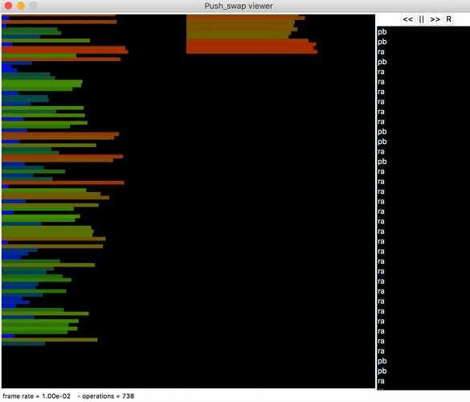

# push_swap
A `C` program that sorts a stack of ints.

This is my version of the **[42](https://www.42.us.org/)** cadet project `push_swap`.

I use a mix of quick sort and selection sort. If there are more than 28 numbers, they're split into partitions of 25, and if there are more than 150 numbers, they're split into 6ths, however many that will be. These partitions are then selection sorted.

 
